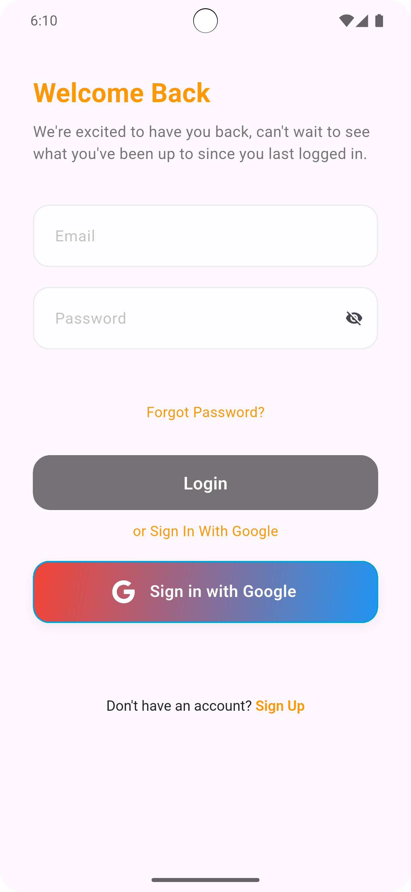
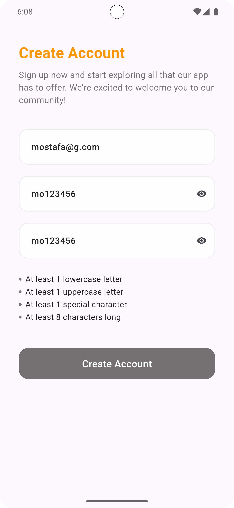
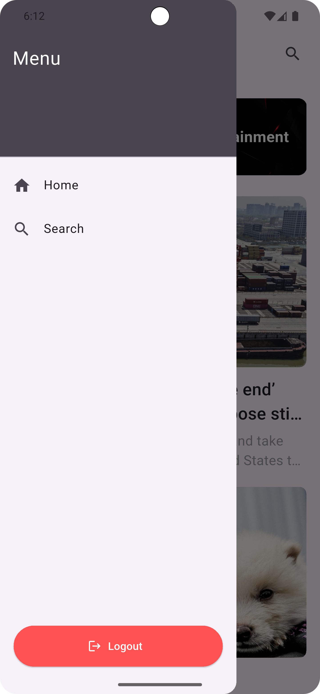
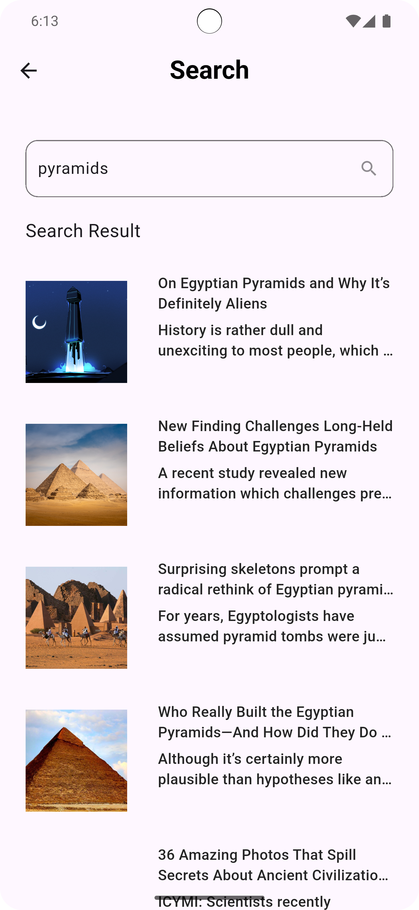

# news_app_eyego

A new Flutter project.

## Getting Started

This project is a starting point for a Flutter application.

A few resources to get you started if this is your first Flutter project:

- [Lab: Write your first Flutter app](https://docs.flutter.dev/get-started/codelab)
- [Cookbook: Useful Flutter samples](https://docs.flutter.dev/cookbook)

For help getting started with Flutter development, view the
[online documentation](https://docs.flutter.dev/), which offers tutorials,
samples, guidance on mobile development, and a full API reference.

### 📱 Screenshots

Below are some screenshots showcasing different parts of the app:

| Login Screen | Sign Up Screen | Home Screen |
|--------------|----------------|--------------|
|  |  |  |

| Drawer | News Categories | Search Feature |
|--------|------------------|----------------|
|  |  |  |

> **Note:** All screenshots are located in the `screenshots` folder in the root directory of the project.

